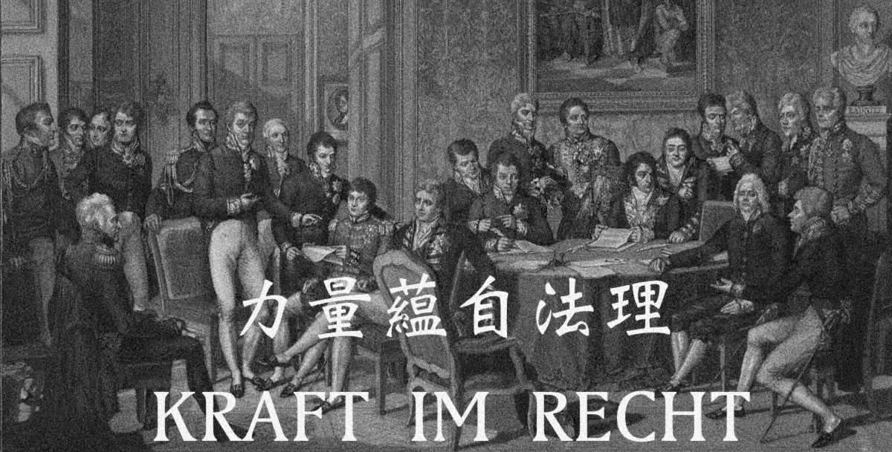

## ABOUT ME

Here is **Xudong Zhu(朱旭东)**
 
I hold a Master of Arts (MA) in American Studies from Ruprecht-Karls-Universitaet Heidelberg.
 

## EDUCATION

**Ruprecht-Karls-Universität Heidelberg**, *Heidelberg Center for American Studies (HCA)*   
Heidelberg, Germany  
*M.A. in American Studies, Political Science and History* 
2023 
  
**Jilin University**, *School of International and Public Affairs (SIPA)* 
Changchun, China  
*Bachelor in Law, Diplomacy*  
2021  

## RESEARCH INTERESTS

- Historical Statecraft
- Realpolitik and Grand Strategy
- Great Power Competition
- Sino-US Relations
- Geopolitics

 

## News and Updates

**[Highlight] I am looking for PhD to start in 2024. Contact me if you have any leads!** 

